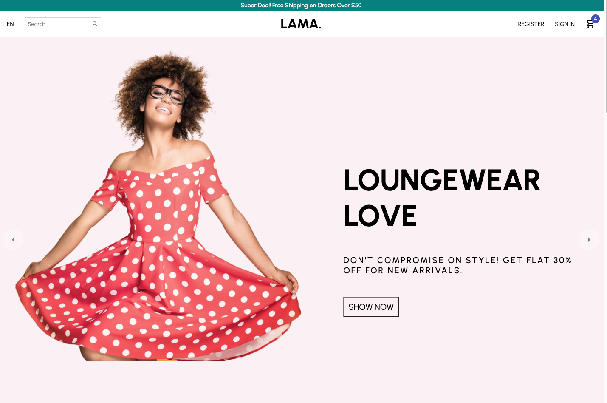

# Lama Ecommerce Website

## Tutorial 

Followed this YouTube tutorial to create the web page. [Here](https://www.youtube.com/watch?v=c1xTDSIXit8&t=650s)

## Cloning the Repository

1. Clone the repo using the command below. 

```sh
git clone blah blah blah
```

2. Install Package Dependences

```sh
npm install
```

3. Run development Server

```sh
npm start
```

### App Preview :

<table width="100%"> 
<tr>
<td width="50%">      
&nbsp; 
<br>
<p align="center">
  Lama Home
</p>

</td> 
<td width="50%">
<br>
<p align="center">
  Lama Cart
</p>
  
</td>
</tr>
</table>
